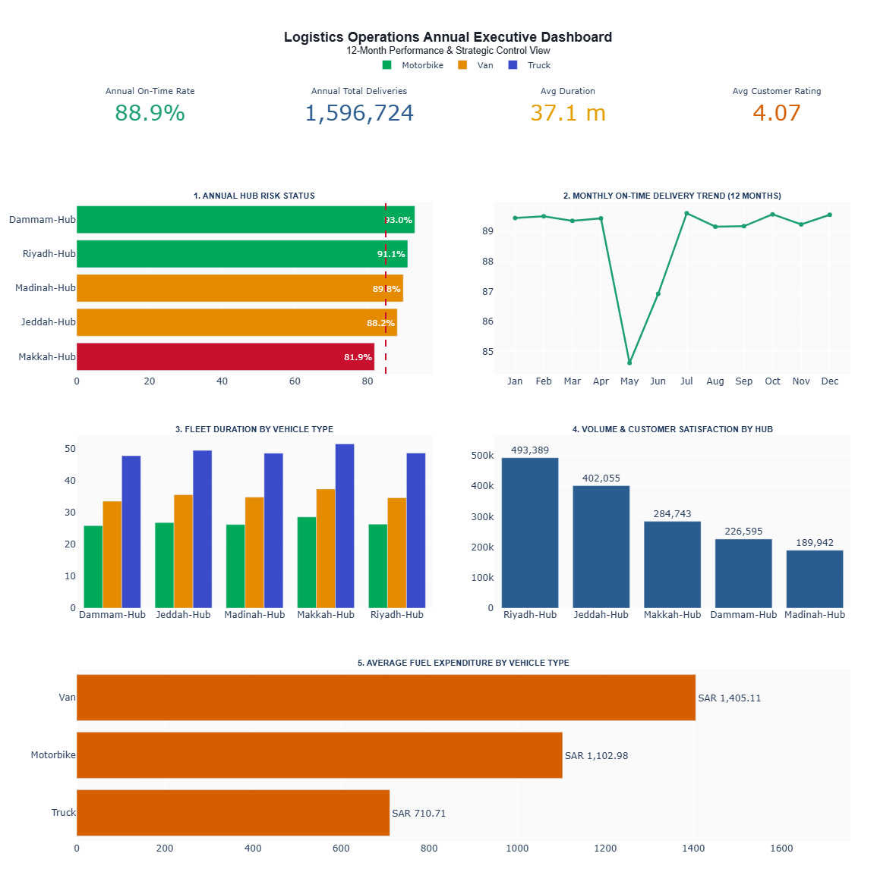

# Saudi Logistics Operations Dashboard


---

## About The Project

This project presents an interactive executive dashboard designed to monitor and analyze 12 months of logistics operations across Saudi Arabia.

The dashboard evaluates key operational performance indicators, identifies potential performance risks, and supports data-driven decision-making through interactive data visualization.

This project was developed as the final practical deliverable for the **Data Visualization & Storytelling Course** at [@SDAIAAcademy](https://github.com/SDAIAAcademy).

---

## Dashboard Preview



---

## Live Dashboard

The interactive dashboard is published and viewable live via GitHub Pages:

**[Launch Live Interactive Dashboard](https://roalamghamdi.github.io/logistics-operations-dashboard-/logistics_dashboard.html)**

---

## Key Outputs & Deliverables

### Interactive Executive Dashboard (`logistics_dashboard.html`)

- Developed using Python and Plotly.
- Provides interactive filtering, zooming, and hover-based insights.
- Presents executive-level operational KPIs.

### Executive KPIs

- **On-Time Delivery Rate:** 88.9%
- **Total Deliveries:** 1.59M
- **Average Delivery Duration:** 37.1 minutes
- **Customer Rating:** 4.07 / 5.00

### Analytical Views

The dashboard includes:

- **Hub Risk Status Analysis:** Evaluates 5 regional hubs against an 85% SLA benchmark.
- **Monthly Performance Trend:** Tracks 12-month delivery performance variations.
- **Vehicle Type Performance Comparison:** Evaluates duration efficiency across Motorbikes, Vans, and Trucks.
- **Delivery Volume Analysis:** Identifies high-density delivery hubs.
- **Fuel Expenditure Analysis:** Analyzes operational fuel costs by vehicle type.

---

## Source Code and Data Pipeline

### `logistics_analysis.ipynb`

The Jupyter Notebook details the complete end-to-end data pipeline:

- Data cleaning, normalization, and preprocessing.
- Metric aggregations and KPI calculations.
- Statistical data analysis.
- Interactive visualization logic using Plotly.

---

## Business Impact

This dashboard supports strategic decision-making in supply chain operations by enabling executives to:

- Monitor overall operational performance through key metrics.
- Pinpoint underperforming logistics hubs needing operational intervention (e.g., Makkah Hub).
- Evaluate fleet efficiency and optimize route planning.
- Analyze seasonal trends (e.g., performance dips in May) for proactive resource allocation.
- Drive cost-reduction strategies regarding fuel expenses.

---

## Technologies Used

- **Programming Language:** Python 3.11
- **Visualization:** Plotly, HTML/CSS
- **Data Manipulation:** Pandas, NumPy
- **Environment:** Google Colab, Jupyter Notebook
- **Deployment & Version Control:** Git, GitHub, GitHub Pages

---

## Dataset Description

The dataset includes 12 months of operational logistics data covering:

- Delivery Date
- Distribution Hub (Riyadh, Jeddah, Makkah, Dammam, Madinah)
- Vehicle Type (Motorbike, Van, Truck)
- Number of Deliveries
- On-Time Delivery Percentage
- Average Delivery Duration
- Fuel Cost (SAR)
- Customer Rating

---

## Project Structure

```text
logistics-operations-dashboard-/
│
├── logistics_analysis.ipynb
├── logistics_dashboard.html
├── logistics_delivery.csv
├── Dashboard.png
├── README.md
└── requirements.txt
```

---

## How to Run

1. Clone the repository:

```bash
git clone [https://github.com/RolaMAlghamdi/logistics-operations-dashboard-.git](https://github.com/RolaMAlghamdi/logistics-operations-dashboard-.git)
```

2. Open `logistics_analysis.ipynb` using Google Colab or Jupyter Notebook.

3. Execute all notebook cells to generate the analytics.

4. Open `logistics_dashboard.html` in any web browser to interact with the dashboard locally.

---

## Course Information

- **Organization:** [@SDAIAAcademy](https://github.com/SDAIAAcademy) (Saudi Data & AI Authority)
- **Course Title:** Data Visualization & Storytelling
- **Course Code:** SDA-DSC-112

---

## Author

**Rola Mansour Alghamdi**

Senior Industrial & Systems Engineering Student

### Areas of Interest

- Supply Chain Analytics
- Logistics Operations
- Data Visualization & Storytelling
- Business Intelligence
- Process Improvement
- Decision Support Systems
